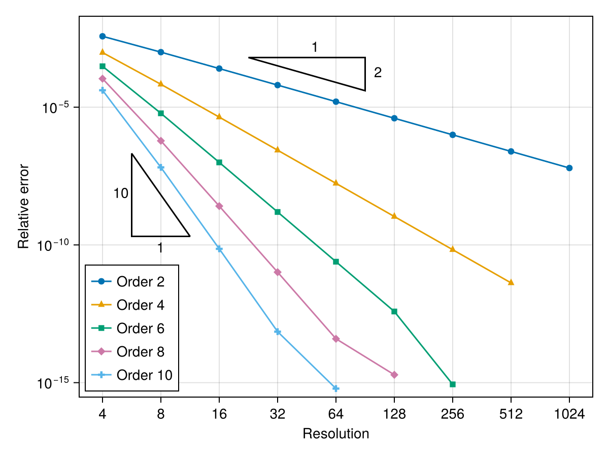

# 🌪️ Turbulox

[](https://agdestein.github.io/Turbulox.jl/stable/)
[](https://agdestein.github.io/Turbulox.jl/dev/)
[](https://github.com/agdestein/Turbulox.jl/actions/workflows/CI.yml?query=branch%3Amain)
[](https://codecov.io/gh/agdestein/Turbulox.jl)
[](https://github.com/JuliaTesting/Aqua.jl)

Turbulence in a box.

https://github.com/user-attachments/assets/74ba86ac-cd78-49e1-ae14-87705c0b044c

## 🚀 Installation

This package is in active development, and breaking changes are expected.
Install the latest version with

```julia
using Pkg
Pkg.add("https://github.com/agdestein/Turbulox.jl")
```

## 📚 Equations

The equations:

$$\partial_j u_j = 0$$

$$\partial_t u_i + \partial_j (u_i u_j) = -\partial_i p + \nu \partial_{jj} u_i + f_i$$

Discretization: Fully conservative combination of
central difference stencils from
[Morinishi et al.](https://www.sciencedirect.com/science/article/pii/S0021999198959629)

## 🫣 Outlook

Disretization orders:

- [x] Second order
- [x] Fourth order
- [x] Sixth order
- [x] Eighth order
- [x] Tenth order


